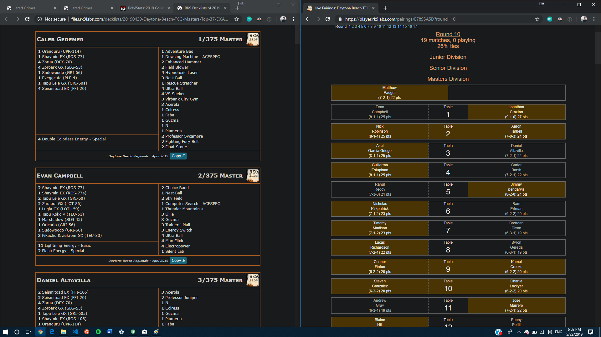
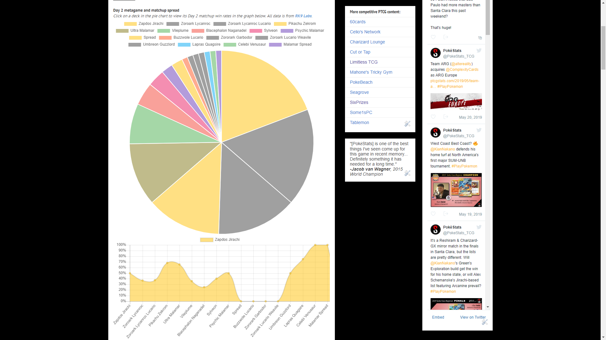

Data is awesome. No, seriously. In our electronic day and age, all data is most likely stored in cloud servers, available to us from a quick ping from our smartphones. Everything we need to know about everything is super accessible to us. So, what about Pokemon tournament data? As of right now, there's no centralized way for us to view mass tournament data other than who played what deck (compiled by the lovely folks over at LimitlessTCG). While this is super nice, there's still a lot more information that would be benificial to us as players that isn't accessible such as, how decks perform against other decks, how card counts of a particular archetype affect performance in a tournament or many tournaments, and how the metagame progresses throughout the entire year. Until now, all of this data has been hardcoded into google docs and graphs, which is extremely oldschool and insanely difficult to keep up with. I mean, it's 2019... come on! That's why I propose a solution - a framework to combine all tournament data so they're easily accessible to developers and the public, something like an API perhaps? The logistics are still quite muffled..

Currently, the project is called PokeFlow, and you can check it out <a href="https://github.com/comp0cker/pokeflow">here on my github</a>. I won't go into detail in this article about the technical nonsense, but if you're interested, head over to my github and read the README. Essentially, I've made a few Python scripts that scrape data from RK9, store them into local json files, and an example application that utilizaes these json files. 

<h2>The Need for a Centralized Tournament Data Collective</h2>

Why do we even need something like this? PokeFlow will allow developers and players alike to visualize tournament data easier. That's the gist of it. Here's a list of statistics we're able to visualize with this type of framework:

<ul>
    <li>Metagame spread for Day 2 (percentage of decks played)</li>
    <li>Deck by deck matchup statistics (how deck X stacks up against deck Y)</li>
    <li>How certain cards in an archetype influence a deck's success</li>
    <li>Metagame trends by date (throughout the year, quarter, month, etc)</li>
    <li>Metagame trends by location (country, state, city, etc)</li>
</ul>

Wait, haven't people done these things before? Yes, these have all been ideas successfully implemented before. However, the means of collecting these statistics and compiling them has been by... dare I say it... <i>by hand</i>... This means that every single version of these graphs people have made in the past have been hardcoded. These graphs were made by people staring at a computer for hours and copy-pasting stats from another website. Why do that when computers can do that for us? That's where the framework comes in. Instead of spending hours at a computer staring and copy-pasting data, we can just hit compile on the fetch script and have everything pop into our database! Then with one more click, the implementation is served! In essence, if we know how to make a specific graph for one tournament, each subsequent tournament's graph generation will take less than a minute (no, seriously)!

So pretty much, the idea of the framework is to make these ideas and many more possible, and easy to make. The hardest part of coding a web application that completes one of these tasks is simply <b>not having the data neccessary</b>. PokeFlow is a way to grab, store, and easily have tournament data be exported so that these ideas (plus many more) can easily become a reality. In fact, the first two already have been! Knowledge is power, and having stats like these (plus many more) available for as many tournaments as possible will give way more power to the players in deck decisions, and what to expect for future tournaments.

<h2>Extracting Tournament Data from RK9</h2>

The first and most obvious problem when trying to create this framework is getting the data in the first place. Well, the lovely folks at RK9 have let us see this data for ourselves (for the tournaments that they run, at least)! Well, sort of. What we have from RK9 is first off, a list of decklists from day 2 players. This by itself is incredibly useful, as we're able to see what archetype each person played. We also have a progressive chart of who played who day 2 and their results. Below is a glimpse of what you see from the Daytona Regional Championships:

As you can see, it's quite easy to go through yourself and view this information, which makes it extremely easy for a computer program to do so as well! All my python script needs to do is look at the page, pull the data, and spit it out into json files. From here we can get into all the data manipulation methods I was referring to before. Pretty cool, right? 

<h2>An Example of the Framework: PokeStats</h2>

The most prominent example of this framework being put into action is actually live on PokeStats! My involvement on the PokeStats team has been great, as I've been able to work with amazing people such as Tate Whitesell, Rukan Shao and the rest of the gang. With them, I've been able to organize my data into a few cool-lookin' graphs as shown:

The above graph is, as you'd expect, another generic pie chart that every competitive team on planet earth generates (thanks <a href="https://twitter.com/daxptcg/status/1116174306973757440">Danny</a>). However, the implementation of the framework comes with the interactive graphs immediately below. Every section of the pie chart you click on opens a new area chart, one that displays a deck's individual matchups against the rest of the decks it played against. This is extremely useful, as we're now able to see how a particular deck faced off against others, instead of theorymoning stuff like, oh this deck went 65/35 against this deck, with having bare to none hard evidence to back it up. All of this generation is done thanks to PokeFlow, as it literally just pulls the raw data from the json files generated.

<h2>The Future of the Framework</h2>

I'm not quite sure where this framework will go to specifically in the future, as this whole thing is still a moving proof-of-concept. But, as a lot of my projects are, this one's entirely community driven. So, if anyone has any ideas they'd like to be implemented, please contact me and I'd be happy to try it out! For the time being, I'm probably going to try to implement an implementation for importing cup data (thanks Rukan!), which will allow super cool graphs such as visualization of entire regional metagame progressions, and allowing specific regions to have their own interactive graphs. This, of course allows players to get a specific look on what's popular in their region, as opposed to using nationwide data from regional championships to dictate a seemingly inacurate metagame report for their next local event.

As I venture off to NYC this summer as an SDE intern for Amazon, I'll probably be very crunched on time to implement on this proof-of-concept for the near future. But, I will be keeping up on those graphs for PokeStats, and implementing the cup visualization as soon as time allows. Hope you all enjoyed the read, and I'll post more updates on my academic, career-related, and Pokemon-related endeavors on the page as they come.

Jared